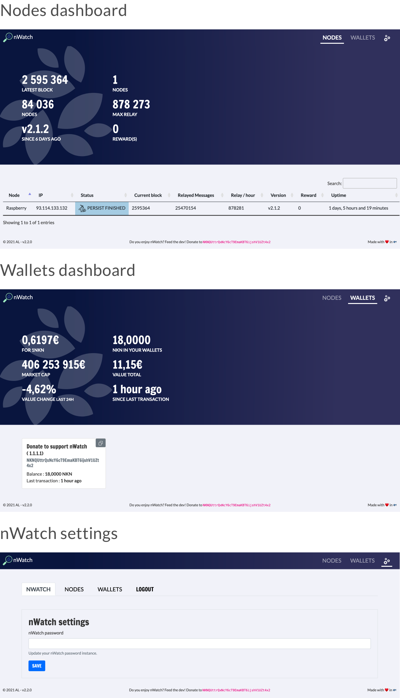

# nWatch - All in one NKN Crypto currency Miner & wallets monitoring

NKN network is based on miners cheap and easy to deploy (from VPS to Raspberry Pi) . You can deploy easily your own node and participate the network. 

nWatch is a NKN nodes and wallets dashboard allowing you to monitor the activities of your miners. 

## Features 

- Desktop AND mobile compatible
- Nodes status 
- Network stats 
- Auto update
- Password protected 
- Wallets balance
- Wallets stats 
- Values displayed in EUR or USD

## How to use nWatch ?

There's 2 ways of deploying nWatch : 

1. ALLinOne deploy
2. Custom deploy

### ALLinOne deploy

nWatch is available in the [ALL-in-ONE-nknnode](https://github.com/no112358/ALLinONE-nknnode) created by no112358. To deploy a nWatch instance follow the instructions provided in the repository. 

### Custom deploy

You can deploy nWatch on any server like a raspberry Pi. Still it required some knowledge about WebServer. We highly recommand you to deploy nWatch using the [ALLinOne deploy script](https://github.com/no112358/ALLinONE-nknnode). 

#### Requirements 
Apache/Nginx, PHP, PHP-Curl 
⚠️ en_US and fr_FR UTF8 locales must be available 

#### Install (Apache - Debian / Ubuntu)

	sudo su - 
	apt-get install git-client apache2 php php-curl language-pack-en language-pack-fr -y
	locale-gen "en_US.utf8"
	locale-gen "fr_FR.utf8"
	dpkg-reconfigure locales
	apt-get autoremove -y 
	cd /var/www/html
	rm -fr * 
	gh repo clone AL-dot-debug/nWatch
	chown -R www-data:www-data /var/www/html

Browse to http://YOUR_IP your nWatch dashboard should be activated. 

## Screenshots

