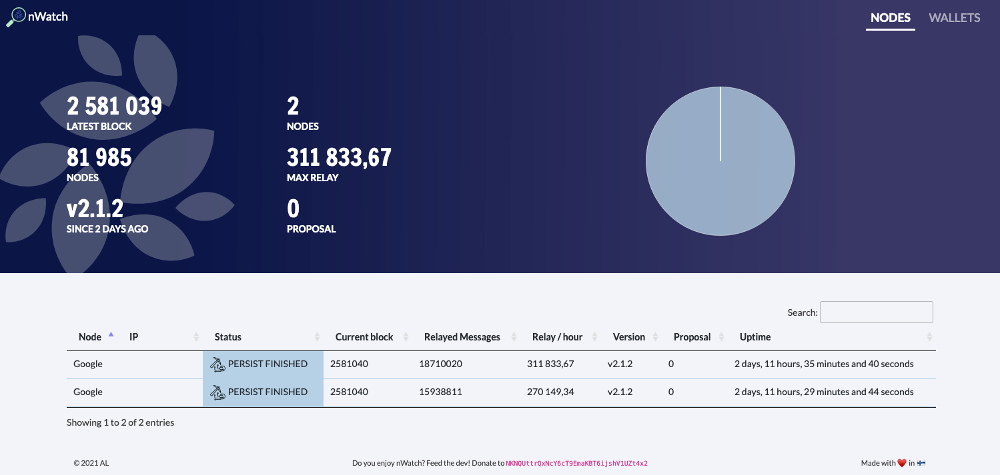

# nWatch - All in one NKN Crypto currency Miner & wallets monitoring

NKN network is based on miners cheap and easy to deploy (from VPS to Raspberry Pi) . You can deploy easily your own node and participate the network. 

nWatch is a NKN nodes and wallets dashboard allowing you to monitor the activities of your miners. 

## Features 

- Desktop AND mobile compatible
- Nodes status 
- Network stats 
- Auto update
- Password protected 
- Wallets balance
- Wallets stats 
- Values displayed in EUR or USD

## How to use nWatch ?

There's 2 ways of deploying nWatch : 

1. ALLinOne deploy
2. Custom deploy

### ALLinOne deploy

nWatch is available in the [ALL-in-ONE-nknnode](https://github.com/no112358/ALLinONE-nknnode) created by no112358. To deploy a nWatch instance follow the instructions provided in the repository. 

### Custom deploy

You can deploy nWatch on any server like a raspberry Pi. Still it required some knowledge about WebServer. We highly recommand you to deploy nWatch using the [ALLinOne deploy script](https://github.com/no112358/ALLinONE-nknnode). 

#### Requirements 
Apache/Nginx, PHP, PHP-Curl 
⚠️ en_US and fr_FR UTF8 locales must be available 

#### Install (Apache - Debian / Ubuntu)

	sudo su - 
	
	apt update && apt upgrade -y && apt install apache2 php php-curl git -y  && apt autoremove -y 
	
	rm -fr /var/www/html/index.html 
	
	git clone https://github.com/AL-dot-debug/nWatch.git /var/www/html/
	
	chown -R www-data:www-data /var/www/html/
	
	dpkg-reconfigure -f noninteractive tzdata && \
	sed -i -e 's/# en_US.UTF-8 UTF-8/en_US.UTF-8 UTF-8/' /etc/locale.gen && \
	sed -i -e 's/# fr_FR.UTF-8 UTF-8/fr_FR.UTF-8 UTF-8/' /etc/locale.gen && \
	echo 'LANG="en_US.UTF-8"'>/etc/default/locale && \
	dpkg-reconfigure --frontend=noninteractive locales && \
	update-locale LANG=en_US.UTF-8
	
	service apache2 restart 

Browse to http://YOUR_IP your nWatch dashboard should be activated. 

### Update 

	sudo su - 
	cd /var/www/html
	git pull 

## Screenshots

